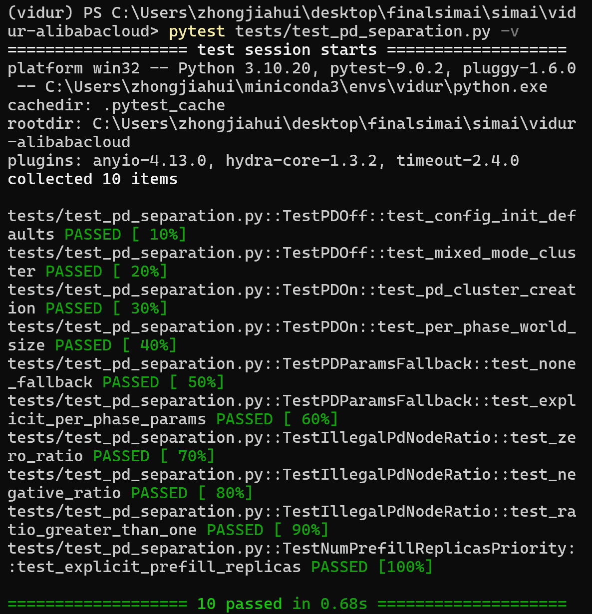

# 成员3 · Vidur 与 PD 调度基线 —— 任务记录

> 负责人：成员3
> 本周目标：跑通 Vidur PD 基线 + 梳理执行链 + 记录缺口（**不开发新功能、不改核心算法**）
> 最后更新：2026-09-03

---

## 一、本周交付物总览

| # | 交付物 | 状态 |
|---|--------|------|
| 1 | Vidur 环境 + pytest 结果 | ✅ 本机已跑通（待 Linux 复核） |
| 2 | 一页 Vidur 执行链说明 | ✅ 已完成 |
| 3 | PD 聚合/分离配置项清单 | ✅ 已完成 |
| 4 | 「动态 KV 传输未实现」证据路径 | ✅ 已完成 |
| 5 | 请求级指标与底层通信是否闭环的分析 | ✅ 已完成 |
| 6 | 通信时延回写 TTFT/TPOT/尾时延的接口草案 | ✅ 已完成 |

---

## 二、已完成项

### 1. Vidur 环境 + pytest 基线 ✅

**环境**：复用已有 conda 环境 `vidur`（Python 3.10.20），未重新 `conda env create`。
依赖经阿里镜像安装：`requirements.txt` + `requirements-dev.txt`。

**结果**：

```bash
cd vidur-alibabacloud
pytest tests/test_pd_separation.py -v
# → 10 passed in 0.91s
```

**终端显示**（Windows 本机实测，`10 passed in 0.91s`）：



五个测试类全绿：PD 关（MIXED 模式）、PD 开（集群分离）、PD 专属参数回退、非法 `pd_node_ratio` 报错、`num_prefill_replicas` 优先级。

**踩坑记录**：本机 conda 未 init 到 PowerShell，`conda` 命令不可用。解决方式二选一：
- 永久：`C:\Users\zhongjiahui\miniconda3\Scripts\conda.exe init powershell` 后重开终端
- 临时：用完整路径 `C:\Users\zhongjiahui\miniconda3\envs\vidur\python.exe -m pytest ...`

### 环境与复现记录（待 Linux 复核后替换 OS/命令段）

| 项 | 值 |
|---|---|
| OS | Windows 11 Home China 10.0.26200（**本机验证，最终需 Linux**） |
| Python | 3.10.20（conda env `vidur`） |
| pytest | 9.0.2 |
| 主仓库 SimAI HEAD | `cf9ed25e41887a633c220ba1661a995ccab6d131`（master，基线 commit） |
| 子模块 SimCCL | `fd7cd57d16f9bd42e3ccb70911c977e18ec294b9` |
| 子模块 aicb | `23eec3c48ca2d2d93dd888a4c7b22ab4421e782f` |
| 子模块 ns-3-alibabacloud | `3e0c7c1bfbbe9f77890ddcf5e5b9c79fc6dd7437` |

> 说明：本任务记录所在的分支 `role3` 提交了 `.gitignore` 与 `.ua/` 图谱数据，但**未改动任何源码**，源码基线仍是 `cf9ed25`。后续在 Linux 复核时以源码基线 `cf9ed25` 为准。

---

### 2. 一页 Vidur 执行链说明 ✅

按 **请求 → 调度 → 计算预测器 → 通信/资源等待 → 指标** 五段展开。

**主循环**：`vidur/main.py:6` → `vidur/simulator.py:67` 的 `Simulator.run()`。
入口 `main()` 只做三件事：`create_from_cli_args()` 读配置 → `set_seeds()` → `Simulator(config).run()`。
主循环是**事件驱动**：用一个 `heapq` 最小堆（`simulator.py:34,80`，优先级 = `(time, id, event_type)`）不断弹出最早事件并 `handle_event`。注意 `vidur/utils/event_queue.py` 里的 `EventQueue`（`queue.PriorityQueue`）是遗留类，**未被 `Simulator` 使用**，实际用的是内联 heapq。

| 环节 | 入口文件 | 职责 |
|------|----------|------|
| 主循环 | `vidur/main.py` → `vidur/simulator.py` | `heapq` 事件队列驱动的主循环，弹出最早事件 → `handle_event` → 回收新事件 |
| 事件 | `vidur/events/*`（8 个事件类） | 状态机：`request_arrival → global_schedule → replica_schedule → batch_stage_arrival → replica_stage_schedule → batch_stage_end → batch_end` |
| 调度 | `vidur/scheduler/global_scheduler/*`（round_robin / split_wise / lor / random）<br>`vidur/scheduler/replica_scheduler/*`（sarathi / split_wise / vllm / orca / faster_transformer / lightllm） | 全局：把请求分配到 replica；单 replica：把请求组 batch、决定 preempt/内存 |
| 预测 | `vidur/execution_time_predictor/*`（base + random_forrest / sklearn + `communication_time_predictor`） | 预测单 micro-batch 在单 TP shard/单 PP stage 上的计算与通信时间 |
| 指标 | `vidur/metrics/metrics_store.py` | 逐请求/batch/token 指标落盘（`_on_request_end` / `on_batch_end`） |

**事件链细节**（每个事件生成下一个）：
- `RequestArrivalEvent`（`request_arrival_event.py:35`）→ `scheduler.add_request` + 生成 `GlobalScheduleEvent`
- `GlobalScheduleEvent` → 全局调度器分配 → `ReplicaScheduleEvent`
- `ReplicaScheduleEvent` → replica 调度器组 batch → `BatchStageArrivalEvent`
- `BatchStageArrivalEvent`（`batch_stage_arrival_event.py:35`）→ `ReplicaStageScheduleEvent`
- `ReplicaStageScheduleEvent` → stage 调度，调用预测器取执行时间 → `BatchStageEndEvent`
- `BatchStageEndEvent` → 下一个 stage 的 `BatchStageArrivalEvent`，或 `BatchEndEvent`
- `BatchEndEvent`（`batch_end_event.py`）→ 指标落盘 + 生成下一个 `ReplicaScheduleEvent`；**PD 分离时在此处做 KV 传输 + 转 D 副本**（见交付物 4）

**与 SimAI/AICB/Docker 组件边界**：见文末「附」。

---

### 3. PD 聚合/分离配置项清单 ✅

位置：`vidur/config/config.py:442` 的 `ReplicaConfig`。

| 字段 | 默认值 | 语义 | 生效条件 |
|------|--------|------|----------|
| `pd_node_ratio` | `1` | P 副本占比。`=1` → MIXED 不分离（所有 replica 同时 prefill+decode）；`0<x<1` → PD 分离（独立 P/D 集群）。范围 `(0,1]` | PD 总开关 |
| `num_prefill_replicas` | `None` | 显式指定 P 副本数；`num_d = total_replicas - num_p` | **优先于 `pd_node_ratio`**，避开 `pd_node_ratio` 不整除问题 |
| `prefill_tensor_parallel_size` | `None` | P 集群 TP；`None` 回退到 `tensor_parallel_size` | 仅 PD 分离生效 |
| `decode_tensor_parallel_size` | `None` | D 集群 TP；`None` 回退到 `tensor_parallel_size` | 仅 PD 分离生效 |
| `prefill_num_pipeline_stages` | `None` | P 集群 PP；`None` 回退到 `num_pipeline_stages` | 仅 PD 分离生效 |
| `decode_num_pipeline_stages` | `None` | D 集群 PP；`None` 回退到 `num_pipeline_stages` | 仅 PD 分离生效 |
| `pd_p2p_comm_bandwidth` | `800` | P→D KV 传输带宽（metadata 标 bps，实际按 Gbps 使用，见下） | PD 分离时 KV 传输 |
| `pd_p2p_comm_dtype` | `'float16'` | KV 传输数据精度；choices `fp8/float16/float32` | PD 分离时 KV 传输 |
| `nvlink_bandwidth` | `1600` | TP/EP 通信带宽（Gbps） | — |
| `rdma_bandwidth` | `800` | TP/EP 通信带宽（Gbps） | — |
| `expert_model_parallel_size` | `1` | **不可手动指定**：`__post_init__`（`config.py:569-575`）强制 = `world_size = tp*pp`，否则 ValueError；`cluster.py` 再次覆盖 | EP 自动 |

**覆盖关系**（`cluster.py:50-165`）：

1. `pd_node_ratio == 1`（MIXED）：`num_p = num_d = num_replicas`；`prefill/decode_world_size = tp*pp*dp`，`prefill/decode_ep = world_size`。
2. `0 < pd_node_ratio < 1`（分离）：
   - `num_prefill_replicas` 非空 → `num_p = num_prefill_replicas`；否则 `num_p = int(num_replicas * pd_node_ratio)`。
   - `num_d = num_replicas - num_p`，二者必须都 >0（`cluster.py:114-118` 断言）。
   - `prefill_world_size = p_tp * p_pp * num_p`，`decode_world_size = d_tp * d_pp * num_d`；`prefill/decode_ep = 各自 world_size`。

**优先级链**：`num_prefill_replicas` > `pd_node_ratio`；PD 专属 TP/PP 为 `None` 时回退到共享 `tensor_parallel_size` / `num_pipeline_stages`（`config.py:582-585`、`cluster.py:120-123`）。

**带宽单位坑**（重要）：`pd_p2p_comm_bandwidth` 的 help 写「bps」，但实际在 `batch_end_event.py:101` 被 `*1024*1024*1024/8` 换算——即该字段语义是 **Gbps**（默认 800 Gbps），换算后才是 bytes/s。`nvlink_bandwidth`/`rdma_bandwidth` 同理是 Gbps。第一周记录时需标注此单位口径。

---

### 4. 「动态 KV 传输未实现」证据路径 ✅

核心在 `vidur/events/batch_end_event.py:87-109`（`SplitwiseGlobalScheduler` 分支内，PD 分离时 P 完成 prefill 后转 D）：

```python
# :90  KV 传输量 = 静态估算（非逐层动态跟踪）
request.pd_p2p_comm_size = request.estimate_kv_cache_size(
    request.num_processed_tokens, replica_scheduler.replica)
# :94  有竞争建模的版本被注释
# transfer_delay = request.pd_p2p_comm_size / (request.bandwidth - request.bandwidth_used)
# :97-98  TODO：带宽应从拓扑获取并考虑竞争
# TODO: determine bandwidth from topology with contention modeling
# :101  带宽 = config 常量（静态）
request.pd_p2p_comm_bandwidth = replica_scheduler.replica.pd_p2p_comm_bandwidth*1024*1024*1024/8
# :104  传输时延 = size / 静态带宽（无竞争建模）
request.pd_p2p_comm_time = request.pd_p2p_comm_size / request.pd_p2p_comm_bandwidth
# :109  回写 decode 到达时间
request.decode_arrived_at = request.prefill_completed_at + request.pd_p2p_comm_time
```

**证据要点**：

1. **KV 传输量是静态估算**：`estimate_kv_cache_size`（`vidur/entities/request.py:411-472`）用固定公式
   `kv_cache_size = 2(K+V) × num_tokens × num_kv_heads × head_dim × num_layers × bytes_per_element`。
   它只按「当前 token 数」和模型静态维度估算总量，**不逐层、不跟踪实际 KV 块/内容**，与真实 vLLM 式的按块 KV 传输（逐 block、可流水、有内存搬移）不是一回事。
2. **传输时延是静态带宽除法**：`:104` 直接 `size / bandwidth`，带宽来自 `ReplicaConfig.pd_p2p_comm_bandwidth`（config 常量，默认 800 Gbps）。
3. **无竞争/拥塞建模**：`:94` 的 `size / (bandwidth - bandwidth_used)`（扣除已用带宽）被注释；`:97-98` 留 TODO「determine bandwidth from topology with contention modeling」；`:80` 还有 TODO「add P2P transmission bandwidth delay overhead here」。当前实现把 KV 传输当作一条**独占、无排队、带宽恒定**的 P2P 链路。

**建议**（第二周接口设计时的落点）：把 `pd_p2p_comm_time` 的静态除法替换为来自成员2通信/网络层的时延（见交付物 5、6）。当前 `pd_p2p_comm_*` 已作为请求属性并在 `metrics_store.py:627-645` 落盘，具备观测接口，缺的是「真实时延来源」。

---

### 5. 请求级指标与底层通信是否闭环的分析 ✅

**结论：请求级指标 ← 通信时延这条链在「Vidur 内部（静态带宽）」是通的，但与成员2的通信/网络层没有闭环。**

**已闭环部分**（Vidur 内部）：
- `batch_end_event.py:109` `decode_arrived_at = prefill_completed_at + pd_p2p_comm_time` —— PD 的 KV 传输时延已回写到 decode 到达时间，进而进入 `decode_time`（`request.py:302` = `completed_at - prefill_completed_at`）、TPOT（`metrics_store.py:570-576` 的 `DECODE_TIME_EXECUTION_PLUS_PREEMPTION_NORMALIZED`）、`e2e_time`（`request.py:154`）。
- **TP 通信时延已经可以通过 backend 接入 SimAI**：`base_execution_time_predictor.py:59-93` 按 `backend` 四选一取 `tensor_parallel_communication_time`，其中 `simai_simulation` / `simai_analytical` 会 `subprocess` 调 `bin/SimAI_simulator` / `bin/SimAI_analytical`（`communication_time_predictor.py:131,267`），读回 CSV 得到 allreduce 时延并回写。这条是「请求级 ← SimAI 通信」的**已经存在**的闭环入口。

**断点**：
- `pd_p2p_comm_time` 是静态公式（`size / 静态带宽`），**未接入** SimCCL / Astra-Sim / ns-3 的任何通信结果。它和 TP 通信走了完全不同的路径：TP 通信有 `TPTimePredictor` 走 backend，PD 的 P2P KV 传输没有对应 predictor，仍是硬编码除法。
- 换句话说：**「TP 通信」已能进 SimAI，「PD 的 KV 传输」不能**——而 PD 场景正是本基线和第二周「EP AllToAll 端到端闭环」要覆盖的关键路径。

**指标产生位置**（回应 plan「记录 TTFT/TPOT/吞吐/P95/P99 在代码中的位置」）：
- Vidur 代码里**没有显式命名 TTFT/TPOT/tbt** 的枚举，这些是上层语义，对应底层为：
  - **TTFT** ≈ `PREFILL_TIME_E2E` = `prefill_completed_at - arrived_at`，落盘于 `metrics_store.py:558-559`。
  - **TPOT（tbt，每 decode token 时间）** ≈ `DECODE_TIME_EXECUTION_PLUS_PREEMPTION_NORMALIZED` = `(completed_at - prefill_completed_at) / num_decode_tokens`，落盘于 `metrics_store.py:570-576`。
  - **e2e_time** = `completed_at - arrived_at`（`request.py:154`）；**decode_time** = `completed_at - prefill_completed_at`（`request.py:302`）。
- **P95/P99/尾时延**：`metrics_store.py` 用 `cdf_sketch` / 直方图对上述 time distribution 做分位统计（`vidur/metrics/cdf_sketch.py`、`_store_request_metrics`），并非逐请求落 P95 值；尾时延需从 request 级分布再聚合。
- **吞吐**：由 `_store_completion_metrics` / token completion 时间序列导出（单位时间完成 token 数），非单一 request 字段。

**底层通信全景**（类型 × 时延来源 × 闭环状态）：

| 通信类型 | 代码位置 | 时延来源 | 闭环状态 |
|---|---|---|---|
| TP 通信（allreduce） | `base_execution_time_predictor.py:59-93` | vidur查表 / simai_simulation(ns-3) / simai_analytical | ✅ 已闭环（唯一接 SimAI 的入口） |
| PP 通信（send/recv） | `base_execution_time_predictor.py:50-57`、`sklearn_execution_time_predictor.py:1260` | 仅 vidur 查表 `send_recv` | ⚠️ 半闭环（未接 SimAI、无 async IO 重叠） |
| EP 通信（alltoall） | `communication_time_predictor.py:32-39` | 无（硬编码 `ep_size=1`，只生成 ALLREDUCE） | ❌ 缺口（最大） |
| PD P2P KV 传输 | `batch_end_event.py:87-109` | 静态 `size/带宽常量` | ❌ 缺口（静态除法） |
| Ray 跨进程通信 | `sklearn_execution_time_predictor.py:1339` | 查表 `ray_comm_time`（CPU 侧） | ✅ 查表（非 GPU 网络） |
| NCCL 启动开销 | `_get_tensor_parallel_communication_time` | 常量 `nccl_cpu_launch/skew_overhead` | ✅ 加在 TP 通信上 |

要点：

- **EP 是最大缺口**：`TPTimePredictor` 构造 `SimAIWorkload(ep_size=1, ...)`（`communication_time_predictor.py:33`），生成的 workload 里只有 `forward_comm="ALLREDUCE"`，没有 `ALLTOALL`。`expert_model_parallel_size` 虽在 config 里自动 = world_size（`cluster.py:127` 注释 EP=TP×DP），但通信预测器根本没用到。MoE 模型（deepseek-671B/qwen3-moe-235B）的 EP 通信只在 `aicb` 后端走 `_get_moe_layer_execution_time_from_aicb`（`execution_time.py:568-601`）读 AICB 预生成数据，`vidur` 默认后端下 EP AllToAll 为空。这正是第二周「EP AllToAll 端到端闭环」要补的洞。
- **PP 半闭环**：不管什么 backend，`_get_pipeline_parallel_communication_time` 都走 sklearn 查表，没接 SimAI；`base_execution_time_predictor.py:53-55` 注释「PP 没有考虑 async IO」，P2P 流水无重叠。
- **遗留竞争模型是死代码**：`vidur/entities/interconnect.py` 有一套 `Link`(NVLink/RDMA/PCIe)/`Flow`/`get_duration = size/(bandwidth-bandwidth_used)`（`:151`）的流级网络模型，能建模多流竞争，正是 `batch_end_event.py:94` 被注释那行的完整版。但它从 astra-sim 抄来后未接线（`flow.py`/`interconnect.py` 顶部 `from simulator import clock, schedule_event` 全是注释，主循环 heapq 不用这套），可复用于第二周竞争建模。

---

### 6. 通信时延回写 TTFT/TPOT/尾时延的接口草案 ✅

**落点**：定义「通信时延回写 schema」，让成员2的 AllToAll/EP 通信结果替换 `batch_end_event.py:104` 的静态除法。这是第二周「EP AllToAll 流量矩阵从 Vidur 到 SimAI 端到端闭环」的请求级入口。

**草案字段**（一个通信操作的请求级描述）：

```json
{
  "comm_type": "alltoall_ep | allreduce | allgather | reducescatter | pd_kv_transfer",
  "src": {"replica_id": 0, "stage": 0, "layer": 0},
  "dst": {"replica_id": 1, "stage": 0, "layer": 0},
  "size_bytes": 33554432,
  "latency_ms": 0.42,
  "timestamp_ms": 12345.67,
  "dtype": "float16",
  "contention": {"link_util": 0.8, "queued_bytes": 1048576},
  "source": "simai_analytical | simai_simulation | ns3 | static_estimate"
}
```

**回写路径**（替换点）：
1. 把 `batch_end_event.py:101-104` 的「带宽常量 → size/bandwidth」替换为：按 `comm_type = pd_kv_transfer` 查 schema，取 `latency_ms` 赋给 `request.pd_p2p_comm_time`。
2. `decode_arrived_at = prefill_completed_at + pd_p2p_comm_time`（`:109`）保持不变——回写点只在这一行之前，上游替换时延来源即可。
3. 对 TP 通信：`base_execution_time_predictor.py:59-93` 已走 backend，schema 可复用为「backend 返回值的统一封装」，让 `vidur/aicb/simai_*` 四种来源统一成一个返回结构。

**边界**（第一周不实现，只记录接口）：
- `source = static_estimate` 时行为与当前一致（保底）。
- `contention` 字段为第二周 ns-3 分组级竞争建模预留，第一周可留空。
- 该 schema 需与成员1的「接口冻结」和成员2的「通信结果输出格式」对齐后再定稿。

---

## 附：Vidur 与 SimAI / AICB / Docker 组件的串接关系

SimAI 是一个**组件套件**，五个组件的职责与分工：

| 组件 | 职责 | 语言/环境 |
|------|------|-----------|
| AICB | 生成 workload（计算+通信模式描述文件）；AIOB 在真实 GPU 上 profile 计算核时间 | Python + GPU（Docker） |
| SimCCL | 把集合通信拆成点对点 flow | C++ |
| astra-sim-alibabacloud | 执行引擎（analytical / simulation 两后端） | C++ |
| ns-3-alibabacloud | 网络分组级仿真 | C++ |
| vidur-alibabacloud | 请求调度层 | Python |

串接方式：**Vidur 是「调用方」，其余是「被调用方」**。Vidur 调度每个 batch 时，由 `execution_time_predictor` 按 `backend` 四选一取「计算 + 通信时间」：

| backend | 数据来源 | 依赖 |
|---------|----------|------|
| vidur（默认） | sklearn 随机森林查表 | 纯 Python，无外部依赖 |
| aicb | 读 AICB 预生成的 CSV（查表 + 首尾线性插值） | AICB + AIOB 在 GPU 上 profile 出的 CSV |
| simai_analytical | subprocess 调 `bin/SimAI_analytical` | Ubuntu 编译出的 C++ 二进制 |
| simai_simulation | subprocess 调 `bin/SimAI_simulator`（ns-3 后端） | Ubuntu 编译出的 C++ 二进制 |

证据：`base_execution_time_predictor.py:59-93`；`communication_time_predictor.py` 的 `TPTimePredictor`。

**SimCCL 的精确调用链**（SimCCL 是 SimAI C++ 引擎内部的一块，不在 Vidur 代码里）：

```text
Vidur: TPTimePredictor.get_execution_time()
  (vidur/execution_time_predictor/communication_time_predictor.py:131)
  └─ subprocess 调 bin/SimAI_simulator            ← Vidur 唯一接点
       └─ astra-sim-alibabacloud 编译出的 astra_ns3 执行引擎
            └─ NcclFlowModel（astra-sim/system/collective/NcclFlowModel.hh）
                 ├─ #include "SimCCL/mock/MockNcclQps.h"   ← :38，SimCCL 调用点
                 └─ MockNccl 把 ALLREDUCE 拆成点对点 flow
                      → ncclFlowModel_detailed_flows.csv
                      → ns3 frontend 读 CSV 驱动分组级网络仿真
```

三个关键位置：

1. **Vidur 触发点** `communication_time_predictor.py:131`：`command = f'...{self.simai_ns3_binary} -t 16 -w ...'`，其中 `self.simai_ns3_binary = f'{simai_dir}/bin/SimAI_simulator'`（`:41`）。Vidur 只生成 `ALLREDUCE` workload 文件、拉起二进制、读回 CSV。
2. **SimCCL 被 include 的地方** `NcclFlowModel.hh:38`：`#include "SimCCL/mock/MockNcclQps.h"`，并在 `:63/:66` 用 `MockNccl::FlowModels` / `MockNccl::NcclQps`。
3. **数据流衔接**（`SimCCL/docs/integration/integration-with-simai.md`）：`SimCCL (MockNcclGroup.cc) → ncclFlowModel_detailed_flows.csv → ns3 Frontend (entry.h: SendFlow())`。

**只有 `simai_simulation` 后端才走到 SimCCL**：`simai_analytical` 走 `AnalyticalAstra.cc`（解析模型直接算，不拆 flow），`vidur`/`aicb` 无 subprocess。证据：simai_simulation 输出 `ncclFlowModel_EndToEnd.csv`（`:124/:138`），analytical 输出 `analytical_EndToEnd.csv`（`:253/:276`）。

两个环境要求的对象不同（别混）：

- **Ubuntu** 服务 C++ 部分 —— `./scripts/build.sh` 编译 SimAI/SimCCL/ns-3，Windows 编不了。
- **Docker** 服务 AICB/AIOB 的 GPU profiling —— DeepGEMM/FlashMLA 只在 Hopper/Blackwell + 特定 CUDA/PyTorch 环境跑，官方用 NGC PyTorch 镜像封装。

对本基线（成员3）的结论：`test_pd_separation.py` 只测 Cluster PD 配置逻辑，不触发执行时间预测器，且默认 `backend=vidur` 为纯 Python——**第一周不需要 SimAI/AICB/Docker/Ubuntu**。仅当用 `--backend aicb`、`--backend simai_*` 或跑 MoE 模型时才需要。

---

## 四、关键代码路径速查

| 需求 | 位置 |
|------|------|
| PD 配置定义 | `vidur/config/config.py:442` ReplicaConfig |
| PD 分离集群创建 | `vidur/entities/cluster.py:50-165` |
| KV Cache 逐请求追踪 | `vidur/entities/replica.py`、`vidur/scheduler/utils/memory_planner.py` |
| PD P2P 通信（KV 传输）建模 | `vidur/events/batch_end_event.py:87-109` |
| KV 大小静态估算 | `vidur/entities/request.py:411-472` `estimate_kv_cache_size` |
| 执行时间预测（backend 四选一） | `vidur/execution_time_predictor/base_execution_time_predictor.py:59-93` |
| TP 通信时间（调 SimAI） | `vidur/execution_time_predictor/communication_time_predictor.py` |
| 指标常量定义 | `vidur/metrics/constants.py` |
| 指标落盘 | `vidur/metrics/metrics_store.py`（`_on_request_end` 515-645） |
| 主循环 | `vidur/simulator.py:67` |

---